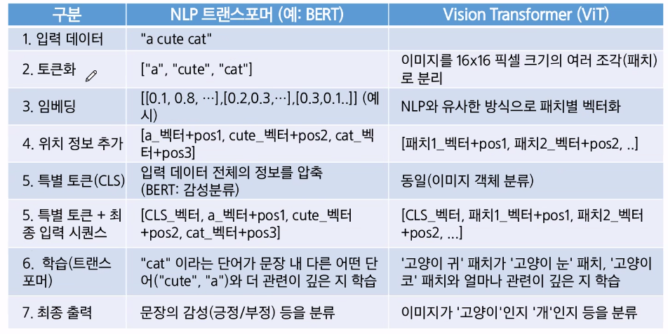

# 이미지생성실습

## 실습을 위한 기초 이론

### VIT vs NLP 트랜스포머 비교
- NLP 트랜스포머
    - 입력 데이터: 문장
    - 토큰화: 단어 또는 서브워드로 분리
    - 임베딩: 각 토큰을 임베딩 벡터로 변환
    - 위치정보: 위치 인코딩을 더함
    - 특별토큰: 토큰을 시퀀스 맨앞에 추가
    - 핵심 엔진: 트랜스포머 인코더
    - 최종 출력: 토큰의 최종 출력 벡터를 MLP에 전달하여 문장 분류

- Vision Transformer
    - 입력 데이터: 이미지
    - 토큰화: 이미지들의 고정된 크기의 패치로 분할
    - 임베딩: 각 패치를 flatten 후 선형 변환하여 패치 임베딩 벡터로 변환
    - 위치정보: 동일
    - 특별토큰: 동일
    - 핵심 엔진: 동일
    - 최종 출력: 동일

## CLIP - 자연어 이미지 사전학습
- 언어와 이미지를 대조하면서 함께 학습한 모델
- 대조 목표를 사용하는 이미지 이해용 신경망 모델과 텍스트 이해용 신경망 모델을 쌍으로 훈련
- 즉, 하나의 이미지와 그 이미지를 설명하는 텍스트를 매칭시키는 모델

- CLIP은 트랜프포머 구조(인코더 + 디코더) 중 인코더 구조만을 사용함
    - 모델의 목적이 이해와 표현에 있기 때문임
    - 순차적인 생성 작업이 불필요하기 때문임
    - 두 개의 독립적인 인코더로 충분하기 때문에

- 다양한 이미지-자연어 쌍으로 학습
