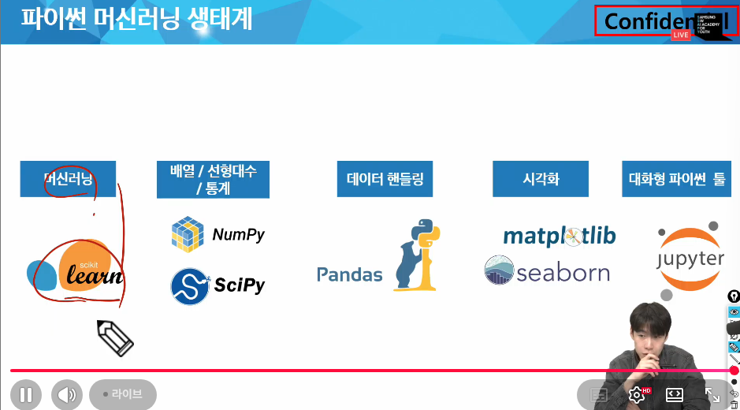

# 한달동안 목표

- 데이터 사이언스
    - 데이터 기초: pandas
- 데이터 엔지니어링
    - 파이프라인
        - 배치 처리
        - spark
        - airflow
        - 엘라스틱 서치 (검색엔진)

## Pandas 기초
    - 데이터 분석 개론
    - Pandas 개념 및 활용
    - 데이터 프레임 생성 및 조작
    - 데이터 정제 및 전처리
    - 데이터 인덱싱과 필터링

## 데이터 분석의 절차
- Step 1. 문제정의
- Step 2. 데이터 기획
- Step 3. 데이터 수집
- Step 4. 데이터 전처리
- Step 5. 데이터 시각화
- Step 6. 분석 및 인사이트 도출

## Pandas
- 관계형 혹은 레이블 된 데이터를 효율적으로 다루기 위해 설계된 파이썬 기반의 데이터 분석 라이브러리
- 1차원을 다루는 series
    - 한줄짜리 데이터 목록으로 모든 값이 같은 타입
- 2차원을 다루는 DataFrame
    - 각 열의 데이터 타입이 다를 수 있으며 크기를 자유롭게 조절할 수 있는 형태